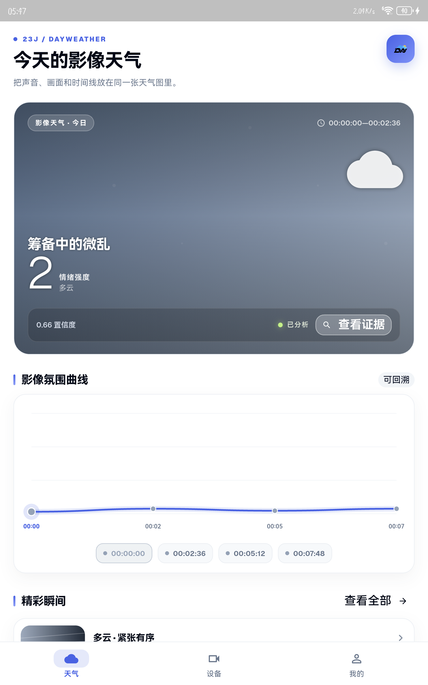
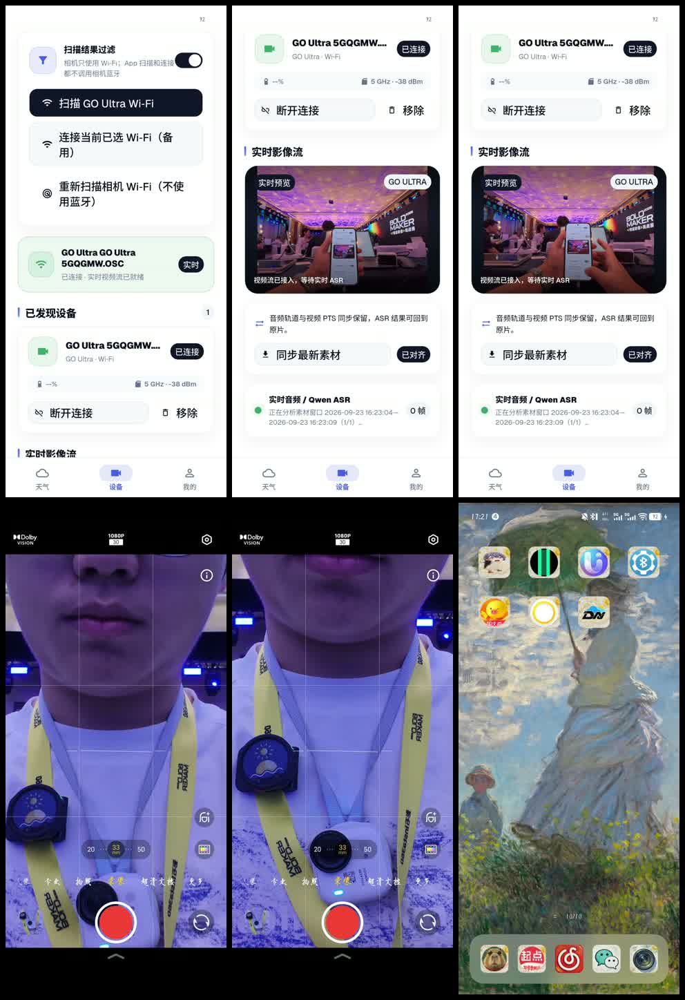
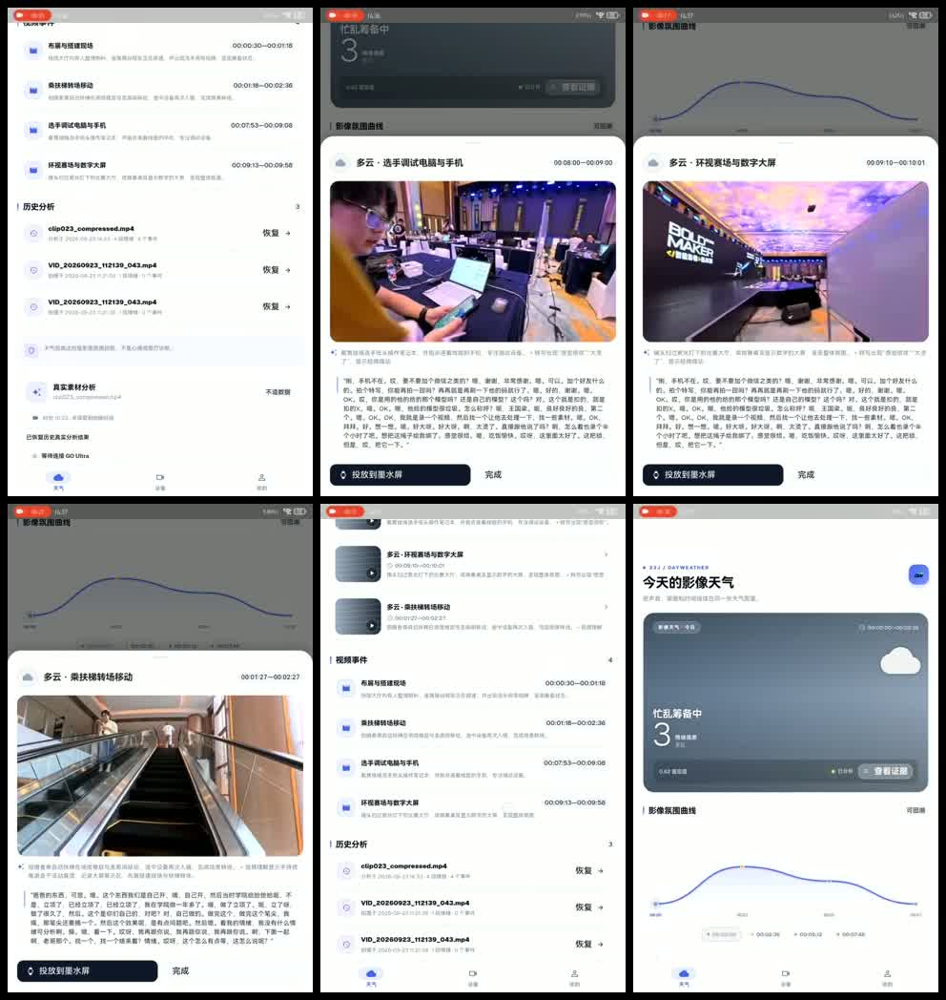
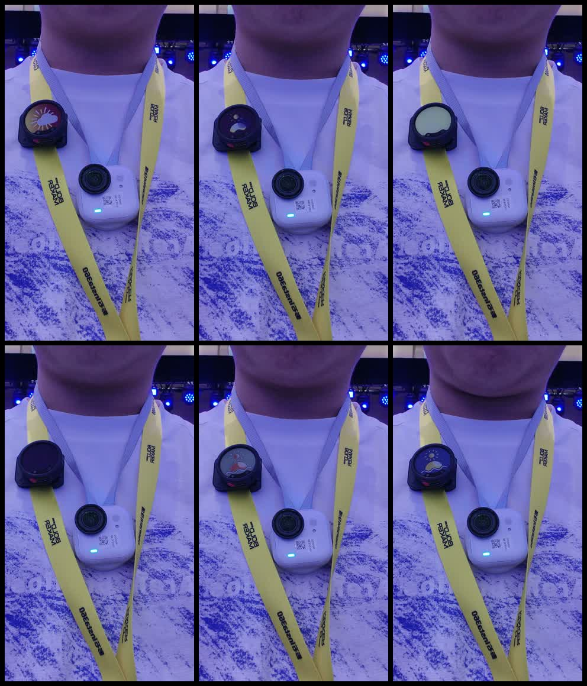

# DayWeather · 一日心晴

<p align="center">
  
</p>

<p align="center">
  <strong>把声音、画面和时间线，变成一张可回看的情绪天气图。</strong>
</p>

<p align="center">
  <a href="https://www.23j1633.xyz/portfolio/projects/DayWeather">查看完整项目介绍 ↗</a>
  ·
  <a href="https://b23.tv/avF5BhF">观看 B 站功能演示 ↗</a>
</p>

> DayWeather 是一个面向 Insta360 GO Ultra 的 Flutter Android 应用原型。它将一天中的影像、带时间戳的音频转写与氛围分析组织成“天气曲线”，让拍下来的生活不再只停留在相册里。



## 项目状态

核心产品闭环已完成，当前仓库对应可运行、可演示、可复盘的 Android 原型版本：

- 已完成 GO Ultra 设备连接、视频流预览、媒体同步与手动导入。
- 已完成音频转写、视频理解、情绪天气曲线、视频事件与精彩瞬间回放。
- 已完成 Mic Pro 状态卡生成、分享导入与 BLE 直连推送链路。
- 已完成中英文切换、明暗主题、历史分析恢复和本地结果持久化。
- 已通过 `flutter analyze`、`flutter test` 和 Android Debug 构建验证。

## 产品展示

### 功能演示

下面直接嵌入 B 站播放器窗口：

<div align="center">
  <iframe src="https://player.bilibili.com/player.html?bvid=BV1Z5ht6sEX3&amp;page=1&amp;high_quality=1&amp;danmaku=0" scrolling="no" border="0" frameborder="no" framespacing="0" allowfullscreen="true" width="100%" height="480"></iframe>
</div>

如果当前 Markdown 平台不允许 iframe，请使用 [B 站原视频](https://b23.tv/avF5BhF) 打开观看。

### 设备连接与实时影像流



### 分析结果与精彩瞬间



### Mic Pro 状态卡



## 核心体验

```text
GO Ultra 拍摄
      ↓
连接相机 / 同步媒体 / 接入实时预览
      ↓
音频转写 + 视频理解 + 氛围分析
      ↓
天气曲线 + 时间戳证据 + 视频事件
      ↓
精彩瞬间回放 + Mic Pro 状态卡 + 历史记录
```

### 1. 把一天变成“影像天气”

应用以天气隐喻呈现影像氛围：晴、多云、阴、雨、暴风和彩虹对应不同的情绪趋势。曲线中的每个节点都保留原片时间偏移，点击节点可以回到对应证据。

### 2. 让 AI 结果有证据可回看

音频转写、视频关键帧、情绪节点和视频事件都绑定真实的原片时间戳。精彩瞬间会被原生剪裁为独立 MP4，而不是只保存一个指针或重复播放整段原片。

### 3. 从手机延伸到 Mic Pro

DayWeather 会把当前影像天气生成 240×208 的 Mic Pro 状态卡，支持六色量化、系统分享导入，以及基于 TRC 协议的 BLE 直连推送，让情绪天气成为随身可见的设备状态。

## 功能清单

| 模块 | 已实现能力 |
| --- | --- |
| 影像接入 | Insta360 GO Ultra 扫描、相机 Wi‑Fi 连接、视频流预览、媒体列表、最新视频同步、手机导入 |
| AI 分析 | Qwen ASR、视频理解、氛围/情绪趋势分析；按 3 分钟窗口覆盖完整素材 |
| 天气曲线 | 晴/多云/阴/雨/暴风/彩虹状态、情绪强度、置信度、时间节点和证据查看 |
| 回看系统 | 时间戳转写、视频事件、精彩瞬间、真实 MP4 裁剪、历史分析恢复 |
| Mic Pro | 240×208 状态卡、4bpp 索引图、240×240 六色 PNG、分享导入、BLE 推送 |
| 应用体验 | 中英文切换、明暗主题、权限与连接状态、隐私提示、本地历史记录 |

## 技术实现

- **客户端**：Flutter 3.x / Dart，使用 `shadcn_flutter` 构建界面。
- **Android 原生桥接**：Kotlin + MethodChannel/EventChannel，对接 Insta360 Android SDK 2.1.5。
- **媒体处理**：保留原始 PTS，按窗口抽取音频和关键帧，使用 `MediaExtractor + MediaMuxer` 裁剪精彩片段。
- **AI 服务**：Qwen `qwen3-asr-flash`、`qwen3.8-max`、`qwen3.8-omni-flash`；实时链路使用流式 ASR。
- **设备输出**：Mic Pro 六色图像生成、索引图转换和 TRC BLE 协议通信。
- **本地存储**：使用 `SharedPreferences` 保存最近 20 次真实分析结果。

## 运行项目

### 环境要求

- Flutter SDK，Dart SDK `^3.9.2`
- Android API 29 或更高版本
- Android 真机或模拟器
- 如需真实 AI 分析，需要百炼 / DashScope API Key

### 安装与启动

```powershell
flutter pub get
flutter run -d <device-id>
```

建议将本机密钥放在被 Git 忽略的 `.dart-define.local.json` 中：

```powershell
flutter run -d <device-id> --dart-define-from-file=.dart-define.local.json
```

也可以直接传入：

```powershell
flutter run -d <device-id> --dart-define=DASHSCOPE_API_KEY=你的Key
```

不要把真实 API Key 写入 Dart 文件、提交到 Git 或上传到公开仓库。

## 构建与验证

```powershell
flutter analyze
flutter test
flutter build apk --debug
```

Debug APK 输出路径：

```text
build/app/outputs/flutter-apk/app-debug.apk
```

首次连接真实 GO Ultra 时，需要按系统提示完成网络、相机 Wi‑Fi 和媒体权限配置。应用只会展示真实扫描到的 GO 系列设备，不生成演示设备或伪造天气曲线。

## 目录说明

```text
lib/
├─ main.dart                    # 应用状态、分析流程与设备连接控制
├─ pages.dart                   # 天气、设备、我的和设置页面
├─ models.dart                  # 天气节点、事件、精彩片段、历史记录模型
└─ services/
   ├─ native_bridge.dart        # Flutter 与 Android 原生能力桥接
   ├─ qwen_service.dart         # ASR、视频理解和氛围分析
   └─ micpro_service.dart       # Mic Pro 状态卡生成
assets/icon.png                 # 应用图标
docs/images/                    # README 产品展示图
```

## 相关链接

- [DayWeather 完整项目介绍](https://www.23j1633.xyz/portfolio/projects/DayWeather)
- [B 站功能演示视频](https://b23.tv/avF5BhF)
- [Mic Pro 自定义壁纸说明](https://onlinemanual.insta360.com/micpro/zh-cn/camera/using-app/e-ink-display)
- [阿里云百炼 OpenAI 兼容 Chat API](https://help.aliyun.com/zh/model-studio/qwen-api-via-openai-chat-completions)

## 说明

本项目为 BOLD MAKER 2026 智能影像挑战赛项目 **23J / DayWeather** 的已完成演示原型。应用中的 AI 分析结果依赖已配置的服务和网络环境；当接口失败时，应用会显示错误，不伪造分析结果。
